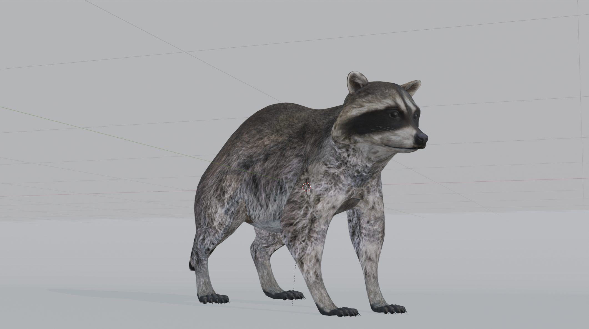
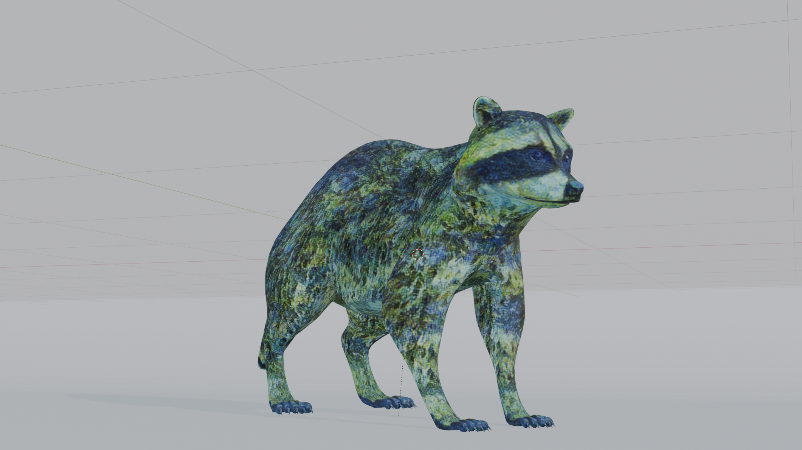

# PedroVerse: 3D Mesh Stylization in Blender

## Features
- Transfer the style of any reference image onto your mesh's UV texture
- Recolor the UV map or style image using color pickers
- Apply a variety of stylization effects, including:
  - Pixelated Image
  - Neural Painter Style
  - Voronoi Watercolor
  - Brushstroke Painterly
  - SLIC Superpixel Art

   
## Installation
1.  Download pedroverse.zip (see Releases)
2.  Extract and run the setup_venv.cmd
3.  In Blender, go to Preferences > Add-ons > Install
4.  Select the texture_recolor.zip from the extracted folder
5.  Enable the add-on

## Usage
1. Select a mesh object with:
   - A base color texture using an image
   - A normal map (if applying normal-based effects)
2. Open the **PedroVerse** panel
3. Choose your stylization method and apply the effect

## Examples

  
  

## License
This project is licensed under the MIT License.

You are free to use, modify, and distribute this software with proper attribution.

